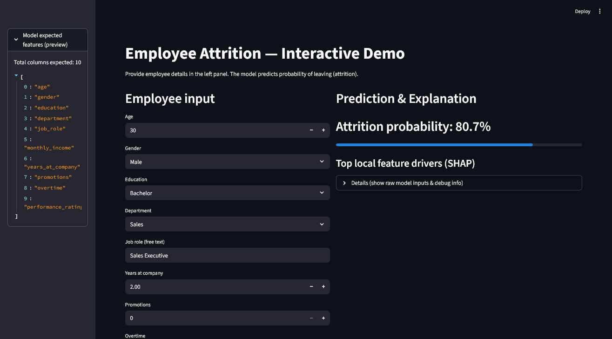
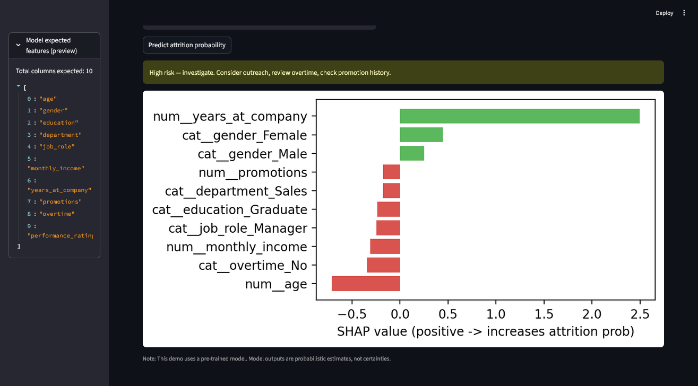

# 🚀 Employee Attrition Prediction — ML Pipeline & Explainable Insights

*A full end-to-end machine-learning solution to predict employee attrition and identify the factors driving it.*

> **Tech Stack:** Python, Pandas, Scikit-Learn, XGBoost, SHAP, Streamlit
> **Deliverables:** Trained model, evaluation report, top drivers, prediction UI/API

---

## 📌 Overview

Organizations lose money, productivity, and experience when employees leave without warning.
This project builds a **predictive ML model** that estimates the **attrition probability** of an employee and provides **interpretable insights** to support HR in making proactive decisions.

The pipeline includes:

* Data cleaning & validation
* Exploratory data analysis (EDA)
* Feature engineering & preprocessing
* Model training (Logistic Regression + XGBoost)
* Hyperparameter tuning
* Evaluation on multiple metrics
* SHAP explainability
* Interactive prediction UI (Streamlit)

---


# 🛠️ Setup Steps

Follow these steps to prepare the environment and train the model.

### **1. Clone / open the project**

```bash
git clone <repo_url>
cd Assignment1
```

### **2. Create and activate virtual environment**

```bash
python -m venv .venv
source .venv/bin/activate       # Linux/macOS
# OR
.\.venv\Scripts\activate        # Windows
```

### **3. Install dependencies**

```bash
pip install -r requirements.txt
```

If you don’t have a requirements file, here’s the minimal set:

```bash
pip install pandas numpy scikit-learn xgboost shap matplotlib seaborn \
            joblib streamlit imbalanced-learn
```

---

# 📓 Instructions to Run the Notebook (`train.ipynb`)

### **1. Open VS Code → Jupyter Notebook Mode**

Ensure the venv kernel is selected.

### **2. Run notebook cells step-by-step**

Each cell performs a clearly defined stage:

1. **Load dataset**
2. **Sanity checks** (missing values, dtypes, duplicates, class imbalance)
3. **EDA** (distribution plots, attrition by groups)
4. **Feature engineering**
5. **Preprocessing pipeline**
6. **Train–test split**
7. **Train Logistic Regression baseline**
8. **Train and tune XGBoost model**
9. **Evaluate metrics on test set**
10. **Interpret with permutation importance + SHAP**
11. **Save artifacts for production**

### **3. Export model artifacts**

Notebook automatically saves:

```
models/preprocessor.joblib
models/xgb_best.joblib
models/feature_columns.joblib
```

These files are required by Streamlit UI or API.

---

# ▶️ How to Run the Streamlit Prediction App

After training:

```bash
streamlit run streamlit_app.py
```

This will open a browser UI where you can:

* Enter employee details
* View predicted attrition risk
* See top SHAP drivers for that specific employee

---

# 🧠 Summary of Key Decisions

This section shows **deliberate engineering choices** — important for interviews and documentation.

---

## **1. Data Cleaning**

* Converted categorical indicators (Yes/No) into numeric encodings.
* Performed **median imputation** for numeric features and **constant imputation** for categorical features.
* Removed duplicates and enforced valid value constraints (e.g., age ≥ 16).
* Ensured consistent dtype coercion so the model pipeline is stable at inference.

---

## **2. Feature Engineering**

* Separated **numeric vs categorical** features programmatically to avoid fragile hardcoding.
* Created derived useful features (if applicable):

  * tenure groupings
  * overtime flags
  * promotion counts
* Applied **ordinal encoding** only to features where order is meaningful (e.g., education).

---

## **3. Modeling Choices**

### Logistic Regression (Baseline)

Chosen because:

* quick sanity baseline
* provides interpretable coefficients
* reveals linear separability limitations

### XGBoost (Final Model)

Chosen because:

* handles non-linear interactions
* robust to imperfect preprocessing
* works well with mixed feature types
* high accuracy & AUC
* compatible with TreeSHAP for interpretability

Hyperparameter search used `RandomizedSearchCV` for efficiency and reduced overfitting.

---

## **4. Evaluation Strategy**

Used **Stratified Train/Test Split** to maintain class balance.

Metrics tracked:

* **Accuracy**
* **Precision**
* **Recall** (important because missing a potential leaver is costly)
* **F1 Score**
* **ROC-AUC** (model discrimination quality)

For imbalanced data:

* Used `class_weight='balanced'`
* Optionally tested SMOTE (but avoided unless necessary).

---

## **5. Explainability Decisions**

To avoid black-box criticism:

### SHAP (TreeSHAP)

* Provides global + local explanations
* Shows direction: whether a feature increases or decreases attrition probability

### Permutation Importance

* Used as a sanity check to avoid SHAP misleading due to feature correlation

Deliverables include:

* **Top global drivers** ranked by mean absolute SHAP
* **Local drivers** for each prediction in the Streamlit UI

---

## **6. Serving / Deployment Decisions**

* Saved **Pipeline + Preprocessor** to avoid schema mismatch.
* Built a Streamlit UI to demonstrate real-world usage.
* Future-ready for API deployment via FastAPI or Docker.

---

# 📈 Sample Outputs (Insert Images Below)


### **Streamlit UI**




--------------------------------------
# 📦 Next Improvements (optional)

* Temporal validation
* Fairness & bias analysis across gender/department
* Calibration curves for probability refinement
* Counterfactual explanations (“what needs to change to reduce risk?”)

---

# ✔️ Final Notes

This project is deliberately engineered to be:

* Reproducible
* Interpretable
* Production-ready
* Interview-friendly

You can confidently present the pipeline, defend modeling decisions, and discuss trade-offs.


