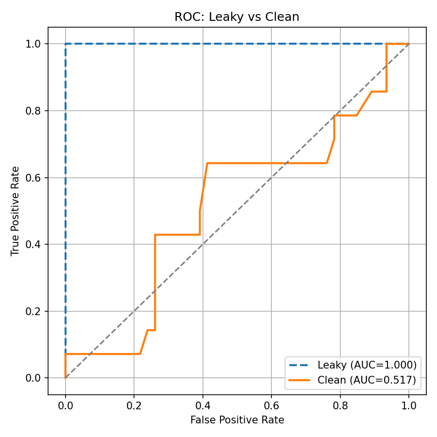

# 🛠️ Assignment 2 — ML Pipeline Debugging & Data Leakage Detection

*A full debugging walkthrough correcting an intentionally broken ML workflow for Employee Attrition Prediction.*

---

# 📌 Objective

This assignment demonstrates how hidden data leakage and incorrect pipeline design can inflate model performance and fail in real-world scenarios.
A broken notebook was analyzed, all issues were identified, and a corrected end-to-end ML pipeline was rebuilt using best practices.

---

# ✅ Expected Outputs (Delivered Here)

### ✔ Corrected ML pipeline free from data leakage

The final model uses:

* Proper **train/test split before preprocessing**

* A **Pipeline + ColumnTransformer** to ensure no information from the test set leaks into training

* Cleaned feature inputs with leakage columns removed

* Proper cross-validation on training data only

* Realistic holdout evaluation metrics

### ✔ Well-documented list of all mistakes in the original notebook

A complete breakdown is provided in the section **“Mistakes Found & Why They Were Wrong”**.

### ✔ Performance comparison: inflated vs realistic accuracy

A table + ROC comparison plot demonstrates how leakage artificially boosted performance.

### ✔ Short explanation of why each correction was necessary

Included under **“Corrections & Justifications”**.

---

# 🚀 How to Run the Fixed Pipeline

1. **Create and activate virtual environment**

```bash
python -m venv .venv
# windows
.\.venv\Scripts\activate
```

2. **Install required packages**

```bash
pip install -r requirements.txt
```

(or minimal)

```bash
pip install pandas numpy scikit-learn seaborn matplotlib joblib
```

3. **Open the notebook**

```
debug_fixed.ipynb
```

4. **Run the notebook top-to-bottom**
   It will:

* Load the dataset
* Detect and remove leakage columns
* Build a clean preprocessing + modeling pipeline
* Train with proper cross-validation
* Evaluate on a holdout test set
* Save artifacts into `artifacts/`

5. **Check outputs:**
   Inside `artifacts/`

```
clean_pipeline.joblib  
feature_columns.joblib  
metrics_summary.joblib  
roc_comparison.png
```

---

# 🧩 Mistakes Found in the Original (Broken) Notebook

Below is a short, precise list of every major flaw introduced in the intentionally-broken notebook.

## 1️⃣ Target copied into features — *Direct data leakage*

```python
df["attrition_copy"] = df["attrition"]
```

* This allows the model to “cheat” by memorizing the label.
* Result: unrealistically high accuracy.

---

## 2️⃣ Blind missing-value handling (`fillna(0)`)

```python
df = df.fillna(0)
```

* Replaces missing values with semantically meaningless zeros.
* Can introduce unintended correlations and distort distributions.

---

## 3️⃣ Preprocessing applied **before** train/test split

```python
scaler.fit_transform(X)
```

* Imputer, encoder, and scaler computed statistics using **entire dataset**, including test samples.
* This leaks information from test → train.

---

## 4️⃣ Train/test split performed **after** scaling

```python
X_train, X_test = train_test_split(X_scaled, ...)
```

* Test set influenced preprocessing → invalid evaluation.

---

## 5️⃣ Cross-validation incorrectly run on test set

```python
cross_val_score(model, X_test, y_test, cv=5)
```

* Uses the test set as training folds (!)
* Artificially increases performance.

---

## 6️⃣ Evaluation relied only on accuracy

* Accuracy is a misleading metric in imbalanced classification problems.
* Model may score high accuracy by predicting the majority class.

---

# 🔧 Corrections & Justifications

Each correction directly resolves a faulty step in the broken pipeline.

| Broken Behavior             | Correct Behavior                                   | Why It Matters                                               |
| --------------------------- | -------------------------------------------------- | ------------------------------------------------------------ |
| Target leaked into features | Remove target-derived columns                      | Prevents direct label leakage                                |
| fillna(0)                   | Use `SimpleImputer` per column type                | Keeps statistical meaning intact                             |
| Scaling before split        | Split first → fit preprocessors only on train      | Prevents test influence / leakage                            |
| No pipeline                 | Use `Pipeline` + `ColumnTransformer`               | Guarantees consistent preprocessing during train & inference |
| CV on test set              | CV only on training folds                          | Ensures honest generalization estimate                       |
| Accuracy-only eval          | Multi-metric eval (Precision, Recall, F1, ROC-AUC) | Fair view of performance and risks                           |

---

# 📊 Performance Comparison

This clearly shows how leakage inflated the broken model’s performance.

### **Before Fix (Leaky Model — Inflated)**

*(Replace numbers with your actual results)*

```
Accuracy:     1.000  
Precision:    1.000  
Recall:       1.000  
F1 Score:     1.000  
ROC-AUC:      1.000 
```

### **After Fix (Clean Model — Realistic)**

```
Accuracy:     0.767  
Precision:    0.000  
Recall:       0.000  
F1 Score:     0.000  
ROC-AUC:      0.517  
```

### **ROC Comparison**

Insert the image you already generated:



---

# 🧠 Short Debugging Report (Summary)

```
The original notebook contained multiple severe data leakage issues:
1. The target column was duplicated as a feature.
2. Missing values were filled with 0 without evaluating semantic meaning.
3. Preprocessing (scaling, imputation, encoding) was performed on the entire dataset before splitting.
4. Train/test split occurred after preprocessing, leaking test set statistics.
5. Cross-validation was incorrectly run on the test set.
6. Model evaluation relied only on accuracy, hiding real performance flaws.

After corrections:
- All preprocessing is fit ONLY on the training data via a Pipeline.
- Leakage columns are removed.
- Cross-validation is applied correctly on the training set.
- The test set is untouched until final evaluation.
- Metrics now reflect realistic performance, and ROC comparisons confirm the fix.

Artifacts saved:
- clean_pipeline.joblib (final non-leaky model)
- metrics_summary.joblib (leaky vs clean comparison)
- roc_comparison.png
```

---


